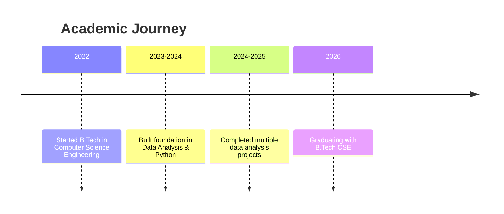
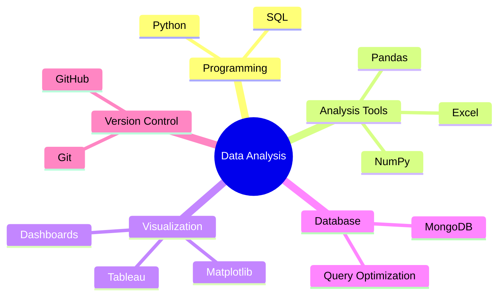

<div align="center">


<br/>

[](https://linkedin.com/in/prajaktawaghmare-992a53258)
[](mailto:pswaghmare04@gmail.com)
[](https://github.com/prajaktawaghmare13)
[](#)

</div>

---

## 👩‍💻 About Me


```python
class DataAnalyst:
    def __init__(self):
        self.name = "Prajakta Waghmare"
        self.role = "Aspiring Data Analyst"
        self.education = "B.Tech CSE (2022-2026)"
        self.location = "Nanded, Maharashtra, India"
        self.interests = [
            "Data Analysis",
            "Data Visualization", 
            "Machine Learning",
            "Pattern Recognition"
        ]
    
    def get_skills(self):
        return {
            "languages": ["Python", "SQL"],
            "analysis": ["Pandas", "NumPy", "Excel"],
            "visualization": ["Matplotlib", "Tableau"],
            "databases": ["MongoDB"],
            "tools": ["Git", "Jupyter", "GitHub"]
        }
    
    def current_focus(self):
        return "Transforming raw data into actionable insights"
```
<br clear="right"/>


I am a final-year Computer Science student with an interest in **data analysis** and **data visualization**.  
I enjoy working with real-world datasets to identify trends, patterns, and meaningful insights that support decision-making.

I have hands-on experience in **data cleaning**, **exploratory data analysis**, **visualization**, and **basic machine learning** through academic and personal projects.

---

## 🎓 Education

<div align="center">




</div>

<table align="center">
<tr>
<td align="center" width="100%">

<br/><br/>
<b>📅 Duration:</b> 2022 – 2026<br/>
<b>🎯 Specialization:</b> Data Analysis & Machine Learning<br/>
<b>📍 Location:</b> India
</td>
</tr>
</table>

---

## 🛠️ Tech Stack

<div align="center">

### 💻 Programming & Analysis


### 📊 Data Analysis & Visualization


### 🗄️ Databases


### 🔧 Tools & Technologies


</div>

---

## 🚀 Featured Projects

<div align="center">

<table>
<tr>
<td width="50%">

### 📈 Industry Skill Insights


Analysis of job market data to identify in-demand skills

**🔍 Key Features:**
- Job market trend analysis
- Skill demand visualization
- Data-driven insights

[](https://github.com/prajaktawaghmare13/industry-skill-insights)
[](https://nbviewer.org/github/prajaktawaghmare13/industry-skill-insights)

</td>
<td width="50%">

### 💰 Sales Performance Analysis


Retail sales data analysis to understand trends and performance

**🔍 Key Features:**
- Sales trend identification
- Performance metrics
- Visual dashboards

[](https://github.com/prajaktawaghmare13/sales-performance-analysis)
[](https://nbviewer.org/github/prajaktawaghmare13/sales-performance-analysis)

</td>
</tr>
<tr>
<td width="50%">

### ⚡ Electricity Consumption Analysis


Exploratory data analysis and prediction of electricity usage patterns

**🔍 Key Features:**
- Consumption pattern analysis
- Predictive modeling
- Billing insights

[](https://github.com/prajaktawaghmare13/electricity-bill-analysis)
[](https://nbviewer.org/github/prajaktawaghmare13/electricity-bill-analysis)

</td>
<td width="50%">

### 🎯 More Projects Coming Soon...


Currently working on exciting new data analysis projects!

**🔍 Focus Areas:**
- Advanced ML models
- Real-time data analysis
- Interactive dashboards

[](https://github.com/prajaktawaghmare13)

</td>
</tr>
</table>

</div>

---

## 📊 GitHub Analytics

<div align="center">


</div>

---

## 🏆 GitHub Trophies

<div align="center">


</div>

---

## 📈 Contribution Graph

<div align="center">


</div>

---

## 💡 Skills Visualization

<div align="center">




</div>

---

## 🎯 Current Focus

<div align="center">

| Area | Status | Progress |
|------|--------|----------|
| 📊 Advanced Data Visualization | Active |  |
| 🤖 Machine Learning | Learning |  |
| 📈 Statistical Analysis | Active |  |
| 🗄️ Database Optimization | Learning |  |

</div>

---

## 📫 Let's Connect!

<div align="center">


<br/><br/>

[](https://linkedin.com/in/prajaktawaghmare-992a53258)
[](mailto:pswaghmare04@gmail.com)
[](https://github.com/prajaktawaghmare13)

<br/>

### 💬 Open to opportunities in:
`Data Analysis` • `Business Intelligence` • `Data Visualization` • `Machine Learning`

</div>

---

<div align="center">

### 👀 Profile Views


### ⭐ Show some love by starring my repositories!


</div>
